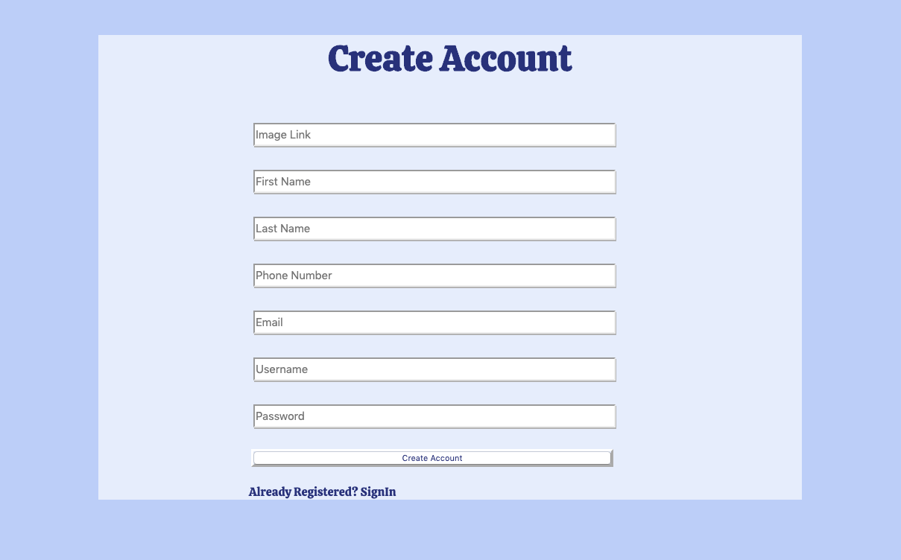
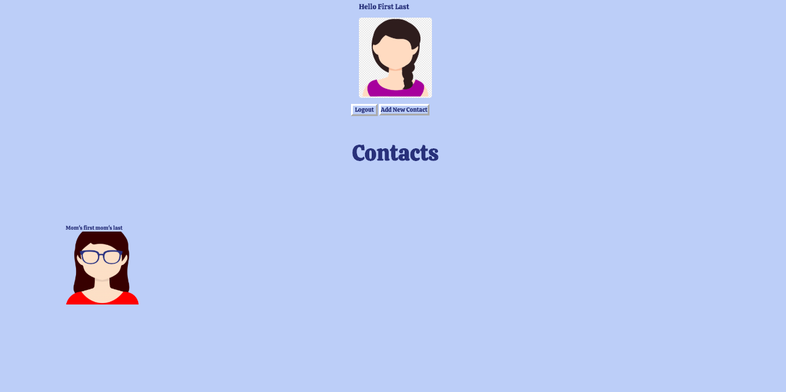
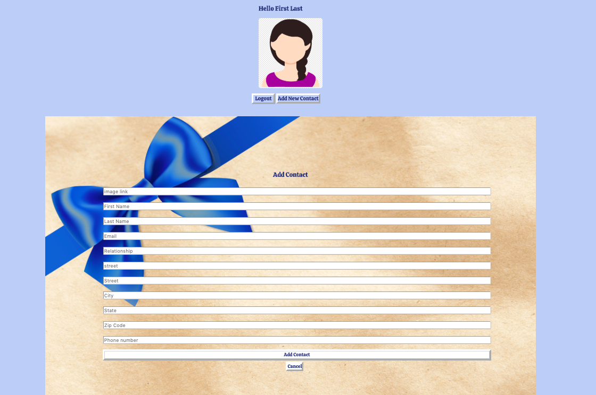
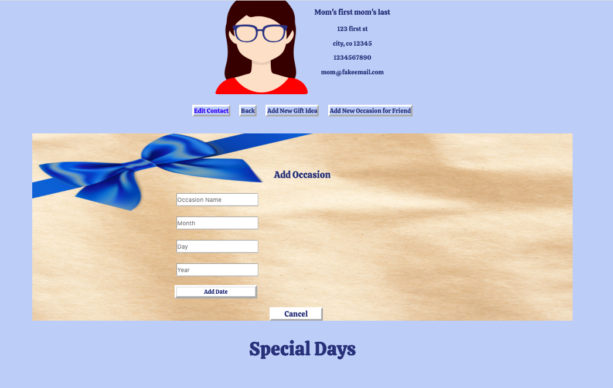
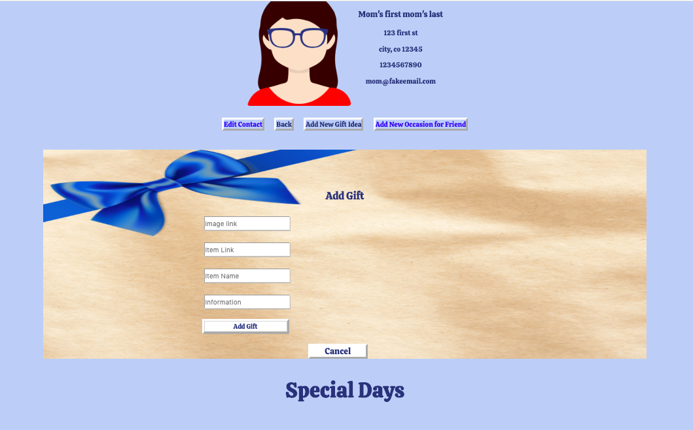
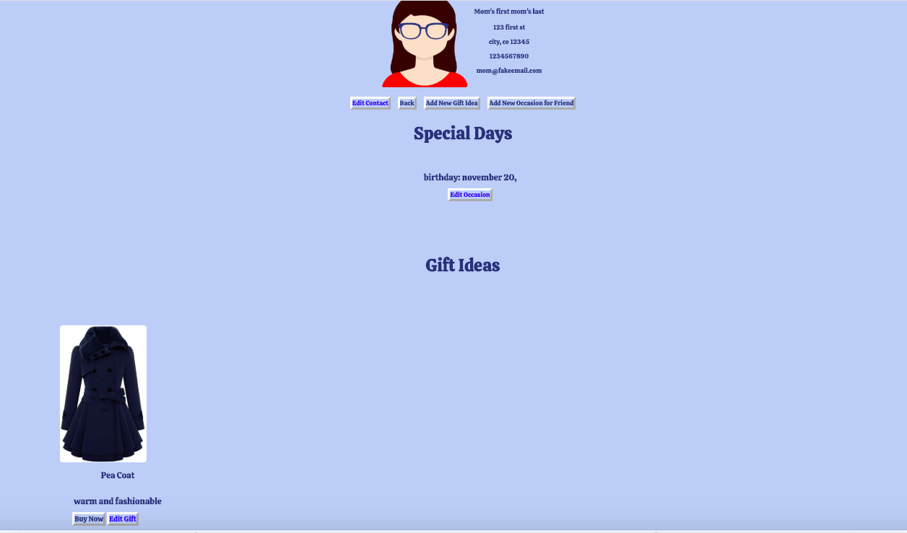

# gift-manager
#### Designed by Arlene George

Gift Manager is a web application that helps you to track your loved ones special occasions and the great gift ideas you have for them.

## Project setup
```
npm install
```

### Compiles and hot-reloads for development
```
npm run serve
```


### Features 

#### 1. Login if you have an account


#### 2. Create New User if you don't have an account


#### 3. Go To User Landing Page



#### 4. Add a Contact


#### 5. Add a New Occasion for your contact


#### 6. Add a New Gift Idea for your contactt


#### 7. View Contact Landing Page



